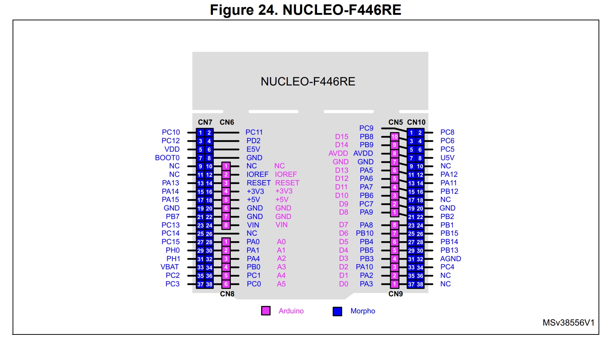

# Nucleo-F446RE APPS and brake-latch bench test

This procedure exercises the firmware logic on a Nucleo-64 with an STM32F446RE. It is a low-voltage bench check; it does not validate a vehicle shutdown circuit.

## Firmware I/O used for the bench

| Function | Nucleo MCU pin | Connection |
| --- | --- | --- |
| APPS1 analog | PC4 / ADC1_IN14, CN10 pin 34 | Potentiometer or signal source, 0–3.3 V max |
| APPS2 analog | PC5 / ADC1_IN15, CN10 pin 6 | Separate potentiometer or signal source, 0–3.3 V max |
| Brake input | PB0, CN7 pin 34 | Switch to GND when pressed; internal pull-up makes open = released |
| Throttle/brake inhibit | PB1, CN10 pin 24 | Active-low output: low = inhibit, high = released |
| Ground | GND | Common reference for sources, switch, and Nucleo |

The USB connector on the Nucleo is the ST-LINK USB connection. The firmware console uses the ST-LINK virtual COM port through USART2 (PA2/PA3), at 115200 baud, 8 data bits, no parity, 1 stop bit. Open that virtual COM port on the host; the terminal baud setting must be 115200. The separate MCU USB-device pins PB14/PB15 are not connected to that ST-LINK connector.

PA4 and PA5 retain the existing DAC functions. PA5 is also connected to the Nucleo user LED LD2, so account for that onboard load if measuring DAC2. Connect PB1 only to a logic probe, oscilloscope, or a 3.3 V indicator circuit with a series resistor during this test. Do not connect it to an inverter, contactor, or vehicle shutdown loop.

Connector pin numbers follow the Nucleo-64 board manual UM1724 Rev 17, Figure 24 and Table 29. The separate APPS schematic depicts an STM32F446RCT6; these Nucleo header assignments are for bench testing only. Check that board's own MCU net mapping before transferring signals to the PCB.

## Equipment and setup

- Nucleo-F446RE, USB cable connected to the ST-LINK USB connector, and a terminal connected to its ST-LINK virtual COM port at 115200 8N1.
- Two independent 0–3.3 V analog sources (two potentiometers are sufficient) for PC4 and PC5. Tie source grounds to Nucleo GND. Keep each wiper below 3.3 V.
- A switch or jumper from PB0 to GND.
- A logic probe or oscilloscope on PB1, referenced to Nucleo GND.

Power the Nucleo from the ST-LINK USB connection. Leave PA4/PA5 and all vehicle-side wiring disconnected. After flashing, confirm `PING` returns `PONG` and run `HELP` in the virtual COM terminal.

## Calibrate the bench inputs

1. Set both analog sources to their chosen released-pedal voltages and send `SAVE LOWER`.
2. Set both sources to higher voltages representing full pedal travel, without exceeding 3.3 V, and send `SAVE UPPER`.
3. Send `GETSAVED`, then move the two sources together through their calibrated ranges. Send `STATUS`; `Throttle` should progress from about 0.0% to 100.0%.
4. With throttle at or below 5%, verify PB1 is high. The firmware starts with PB1 low and only releases it after valid APPS readings at or below 5%.

Calibration saves to flash. Select endpoints that are repeatable and leave enough voltage margin from 0 V and 3.3 V.

## Functional cases

| Case | Inputs | Expected `STATUS` / PB1 result |
| --- | --- | --- |
| Normal released | Both APPS at 0%; brake released | `Inhibit: HIGH`, PB1 high |
| Brake at 24% | Both APPS at 24%; press brake | No trip; PB1 remains high |
| Brake at 25% | Both APPS at exactly 25% or above; press brake | Latch sets; PB1 goes low |
| Brake released, throttle stays above 5% | Release brake and keep APPS above 5% | PB1 remains low |
| Throttle at 6% | Keep brake released and set both APPS to 6% | PB1 remains low |
| Clear threshold | Set both APPS to 5% or below | Latch clears; PB1 returns high |
| APPS out of range | Move either input below its saved lower or above upper limit | `APPS: FAULT`; DAC commands go to zero and PB1 goes low |
| Sensor recovery | Restore valid readings above 5% | PB1 remains low until both channels are valid and throttle is at or below 5% |

Also try pressing brake at 10%, then release it: this must not set the latch. Repeat the trip and clear cases several times while watching both the reported state and PB1 on the probe. Record measured trip and clear percentages; ADC quantization means the exact transition can move by a small amount around the nominal threshold.

## Pass criteria and records

Pass when PB1 changes low at the brake-plus-25% condition, stays low after brake release and while throttle is above 5%, and returns high only at or below 5% with valid APPS inputs. Record firmware revision, calibration counts, APPS voltages, console `STATUS` output, and PB1 voltage for each case.

This bench test does not establish sensor mismatch detection, response time, electrical fault coverage, or the actual vehicle torque-removal behavior. Verify the schematic’s intended MCU pins and output polarity before transferring this logic to the PCB or vehicle.

## Pinout configurations

